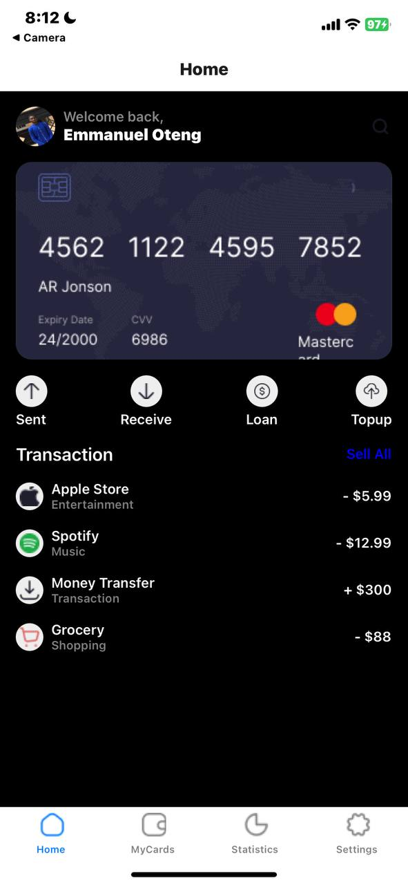
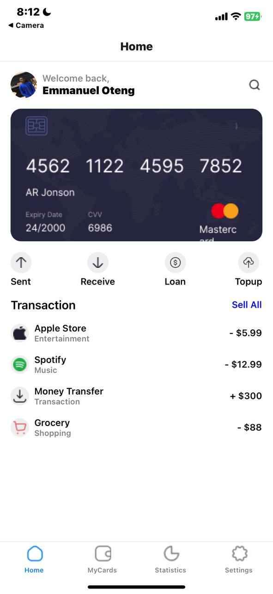
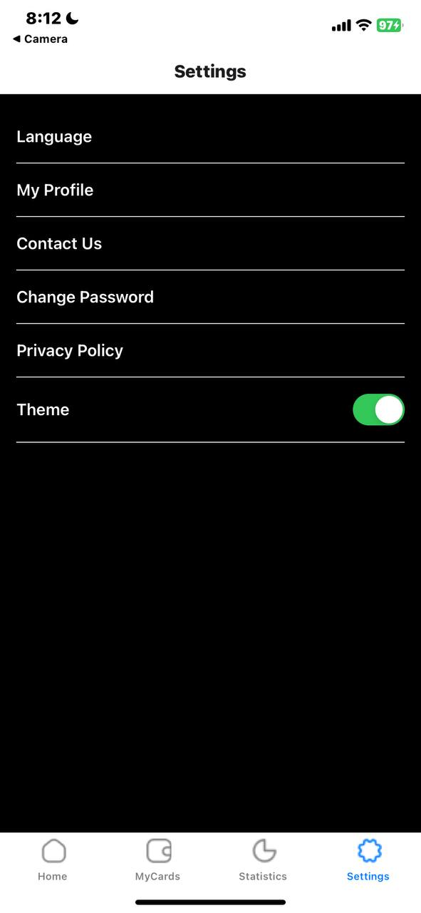
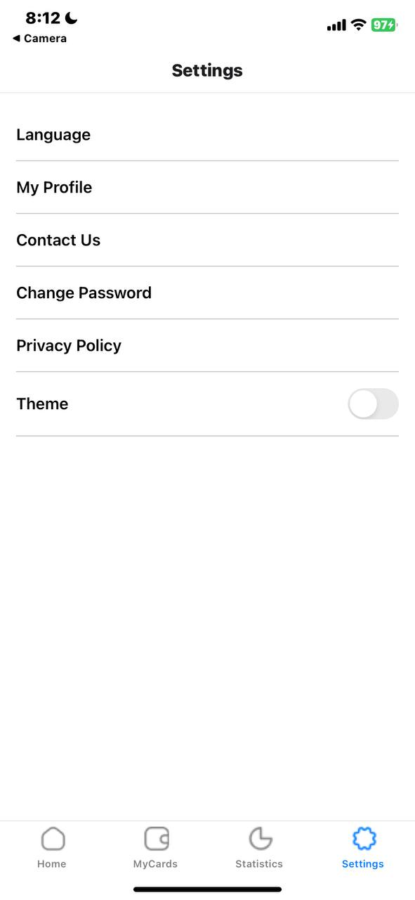

# App

This project is a React Native application that utilizes navigation, themed components, and multiple screens.

# Project Structure

-App.js
-assets/
-home.png
-myCards.png
-settings.png
-statistics.png
-screens/
-HomeScreen.js
-PlaceholderScreen.js
-SettingsScreen.js
-theme.js
-package.json
-README.md

## Setup

To get started with the project, ensure you have Expo installed and run:

bash;
expo install react-native-reanimated react-native-gesture-handler
expo install @react-navigation/native @react-navigation/bottom-tabs
expo start

## Customizing Themes

You can customize the light and dark themes in theme.js to match your design preferences.

## Adding More Screens

To add additional screens
Create a new screen component in the screens/ directory.
Import the new screen in App.js.
Add a new Tab.Screen entry in the Tab.Navigator component

## javascript

import NewScreen from './screens/NewScreen';

// Inside Tab.Navigator
<Tab.Screen name="NewScreen" component={NewScreen} />

# SCREENSHOTS

